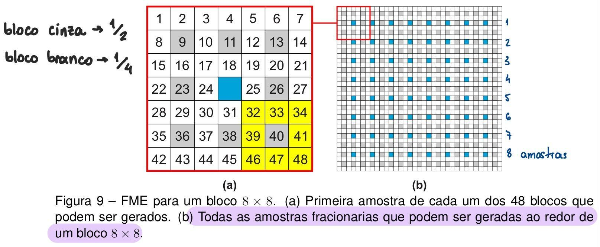
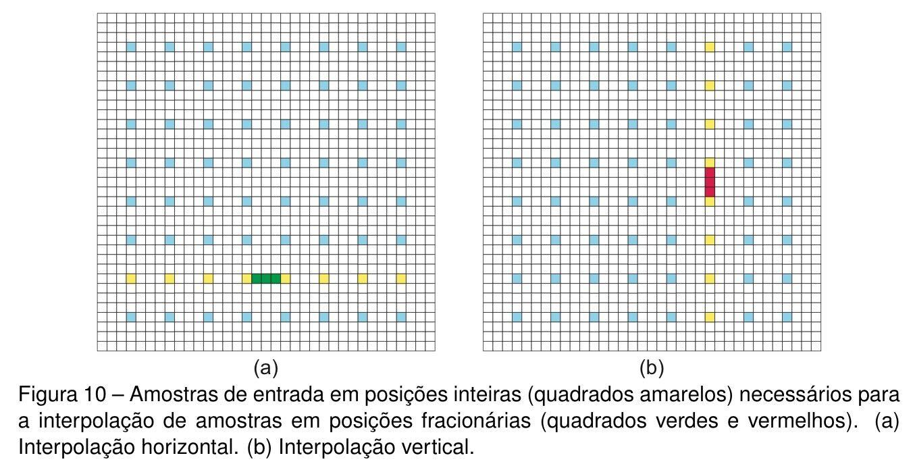

# Interpolation notes
-  VVC define filtros de interpolação de **8-taps**, que utilizam **até** 8 amostras de posições inteiras ao redor da amostra gerada: ? 
- O VVC define que os **Motion Vectors (MVs)** tenham precisão de até 1/4, então por exemplo entre os inteiros 1 e 2, temos: 1, 1.25, 1.50, 1.75 e 2. Logo, são necessários **3 filtros** diferentes de interpolação para gerar essas 3 amostras fracionárias. 
- O bloco de pixels originais é na verdade o bloco resultante da **Integer Motion Estimation (IME)** e é a partir dos blocos resultantes dessa etapa que devem ser gerados os blocos fracionários. 

    **Figura 9.** Abaixo podemos ver em azul, o bloco inteiro resultante da IME e em volta temos 48 outros blocos fracionários gerados. Essas 48 amostras são a quantidade total de blocos fracionários que podem ser gerados. 
    No caso de ser uma Motion Compensation (MC) não necessariamente se deve gerar todos esses blocos, mas apenas aqueles necessários indicados pelo MV. 
    **Em 9a)** há um exemplo do algoritmo empregado pelo VTM que avalia apenas os 16 blocos de 1/2 precisão ao invés de comparar todos os 48 blocos de uma vez com a CB atual. Então, depois de encontrar o melhor bloco candidato (que pode ser um inteiro também), que no exmplo foi o 40, o algoritmo gera os outros blocos de precisão 1/4 em volta do 40 (em amarelo) e estes são comparados com a CB.
    

    **Figura 10.** Abaixo, em 10a) os 8 blocos inteiros horizontais, em amarelo são necessários para a geração dos 3 blocos fracionários em verde. Já em 10b) , está representado o mesmo processo porém para geração de 3 amostras fracionárias verticais, em vermelho, a partir dos 8 blocos inteiros, em amarelo.
    

- > "**As amostras interpoladas são então agrupadas para gerar os blocos candidatos em posições fracionárias**, e esses blocos candidatos avaliados quanto a sua similaridade com a coding block atual pelo passo de busca e comparação. No total, até 48 novos blocos em posições fracionárias podem ser gerados ao redor do resultado da IME. **A Figura 9a) representa o agrupamento das amostras em posições fracionárias**, na qual cada um dos quadrados de 1 a 48 representam a primeira amostra de cada um dos 48 blocos fracionários que podem ser gerados" (p. 26, Exame de qualificação Murilo).
- From the PCS article:
    > "VVC simplifies this model by using **pixel blocks** instead of individual pixels, resulting in lower memory usage and complexity. Each macroblock consists of many 4x4 pixel sub-blocks. Each ub-block has its own macro-block-derived motion vector estimate (MV), which in VVC can range from a single sub-block (4x4 pixels) to a 128x128 block (1024 sub-blocks) [3]"