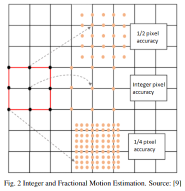
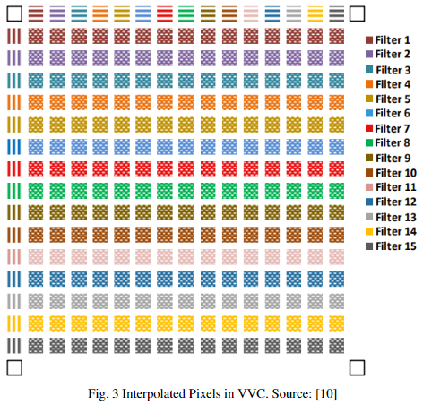
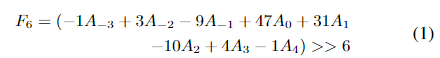

# Motion estimation (ME), Motion Compensation (MC) and Fractional Motion Estimation (FME)

- Current video coding standards support fractional-precision motion vectors as well. 
- The purpose of this step is to allow sub-pixel motion representation, which is common when higher frame rates are used. 
- To implement this, the ME process is composed of two steps: IME and FME. 
- In the video encoder, to generate fractional precision motion vectors, it is necessary to define FME, which is composed of two steps: 
  - (i) interpolation filter to generate fractional pixels, since the only pixels available in the image are those of full precision; and 
  - (ii) search stage to find the fractional block with better resemblance to the original block, to find the direction in which the sub-pixel shift occurred. 
- Like in the FME, MC must realize an interpolation process to obtain fractional samples from integer ones when a fractional MV is used. Hence, interpolation filter is an important component of codec design, because it is used in both the encoder and decoder.
- Another observation is that MC architectures have smaller throughput requirements than ME ones, because the ME operation is performed over several candidate blocks for each input block, whereas MC only interpolates a single block (the best one found in ME) for each input block. 
- Fig. 2 shows an example of MVs with integer and fractional accuracy, thus requiring IME and FME.
- > **HEVC** supports 1/2 and 1/4 pixel MV accuracy, which means the **FME generates three fractional pixels between two integer pixels** in horizontal and vertical directions, and also nine pixels in the diagonal region, **generating 15 interpolated pixels for each integer pixel**. This interpolation is computed using 7-tap and **8-tap** Finite Impulse Response (FIR) filters.
- > In **VVC**, the accuracy of a MV is 1/16 of a pixel, so **15 pixels are interpolated** horizontally and vertically, plus 225 pixels for the diagonal region, resulting in **255 interpolated pixels for each integer pixel**. This represents 17x more interpolated pixels in VVC compared with HEVC. Hence, it is expected at least a 17x increase in computational complexity of VVC interpolation filter compared to the one defined in HEVC.
    
- Like HEVC, **VVC uses 8-tap FIR** filters to generate fractional pixels. Each of the **15 filters** has its own coefficient set. The filter coefficients are shown in Table I. An example of how filter 6 (F6) is calculated from the  8 integer input samples **A−3, A−2, A−1, A0, A1, A2, A3, and A4** is shown in (1). 
  - > OS COEFICIENTES DADOS REPRESENTAM 15 FILTROS DE 8-TAPS CADA, ENTÃO PARA O CÁLCULO DA INTERPOLAÇÃO, TEMOS:
        INPUT = 8 AMOSTRAS INTEIRAS
- > FME utiliza precisão de 1/4, ou seja, apenas 3 dos 15 filtros são necessários (Mateus que disse).