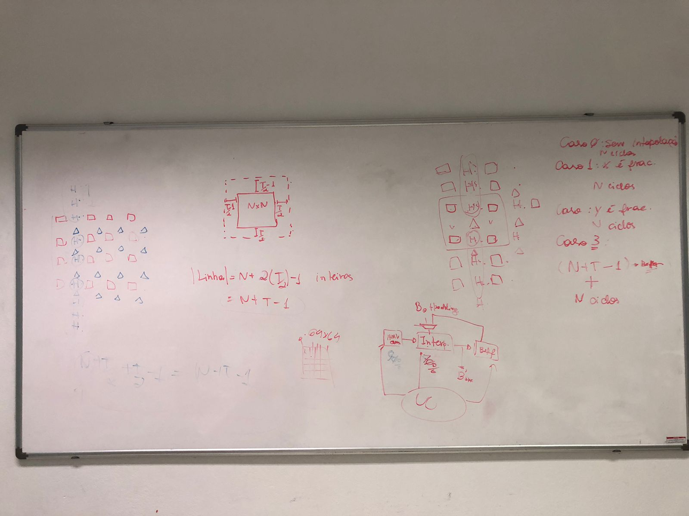

# Feb 14th, 2023
- Também é necessário **interpolar as amostras fracionárias para o padding**. Então considera que o padding vem pronto e é inteiro, por isso precisa gerar paddings fracionários para conseguir gerar as amostras fracionárias das bordas do bloco. 
- **Número de ciclos** necessários em cada caso:
  - Caso 0: sem interpolação
    N ciclos
  - Caso 1: só X fracionário
    N ciclos
  - Caso 2: só Y fracionário 
    N ciclos
  - Caso 3: X e Y fracionários
    1a passada: (N+T-1) ciclos
    2a passada: N ciclos
- **Tamanho da linha** de entrada do interpolador: 
    = N + 2*(T/2) - 1
    = N + T - 1

To do's:
- [ ] **Sintetizar o MV generator** para ter uma ideia da frequência atingida. Se a freq já estiver muito maior do que a do interpolador combinacional, então adiciona pipeline no interpolador para tentat equalizar. Se a frequência for muito maior, precisa alterar as multiplicações sendo feitas pelo MV generator.
- [ ] Controles!

---
# Dec 29th, 2022
fme = interpola os bloquinhos em volta e deopis faz a busca 
tem que gerar todos os blocos intermediarios 

MC = ja sabe qual bloco quer gerar entao nao precisa ficar gerando todos 
X e Y int: nao precisa interpolar nada 
X ou Y fracionarias: uma parte é inteira e a outra só que é frac, então nao precisa ter duas passadas 
X e Y frac: 
ver o vetor de entrada e decidir se tem que interpolar em uma ou duas passadas, ou se passa o bloco inteiro direto (vetor inteiro para x e y) 
eu recebo 2 ou 3 vetores 

como entrada geral: linha do bloco inteira, 
não esquecer do padding 

interpolação só precisa de um vetor fme (1 vet) ou um vet affine (2 vets) + uma linha 

o controle tem que decidir se vai se affine ou fme. e em cada um desses casos, tem que verificar se é em uma, duas ou nenhuma passada. 

para decidir se é affine ou fme, deve vir um sinal de controle externo que diria isso 

POWER POINT: 
vetorZ = para affine de 3 ptos 
mux tem seletor de 2 modos: fme ou gerador de vetores affine 
gerador de vet: precisa de seletor para 2 ou 3 pontos 

verificação com python e com metodo de testbench, pode ser igual da chipus
affine é sempre 4x4 mas poderiamos pensar em duas linhas em paralelo 
lembrar que é com pipeline 

15 de março: artigo 
1 de março: arquitetura pronta