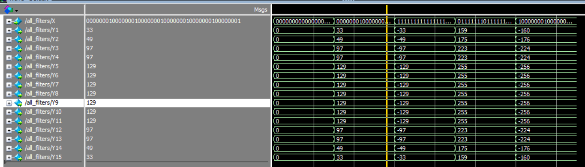

# To do list

- [ ] O que é mais eficiente: ROM com todos os valores possíveis de multiplicação ou um multiplicador de propósito geral????
- [ ] 
- [ ] Iniciar a escrita do artigo para a semana que vem!

- [ ] **Trocar multiplicação por -1 e por NOT**

- [x] **Verificar se está gerando certo para 0, 1, -1, 127, -128**

- [ ] **Síntese do MV generator:** verifica qual a frequência atingida para ver se precisa fazer pipeline no interpolador ou se vai precisar alterar as multiplicações dentro do MV generator
- [ ] **Datapath:**

- [ ] Procurar paper  da referência [10] do paper Approximate Hardware Architecture... do Ícaro
---
- [x] ALTERAR DE ALWAYS PARA COMBINACIONAL DIRETO!!
- [x] Generate port mode declaration (Y's sizes corrected)
- [x] Verificar o rounding term do final do cálculo da interpolação 

// MV_H
SUB_H = MV_1_H - MV_0_H;        // 9 bits = 8 bits + 8 bits
SUB_V = MV_1_V - MV_0_V;        // 9 bits = 8 bits + 8 bits

MULT_H = SUB_H * X_COORD;       // 17 bits = 9 bits * 8 bits
MULT_V = SUB_V * Y_COORD;       // 17 bits = 9 bits * 8 bits

DIV_H = MULT_H >> 4;            // 17 bits >> 4 = 13 bits
DIV_V = MULT_V >> 4;            // 17 bits >> 4 = 13 bits

SUM_0 = DIV_H + DIV_V;          // 14 bits = 13 bits + 13 bits
SUM_1 = SUM_0 + MV_0_H;         // 15 bits = 14 bits + 8 bits

// MV_V