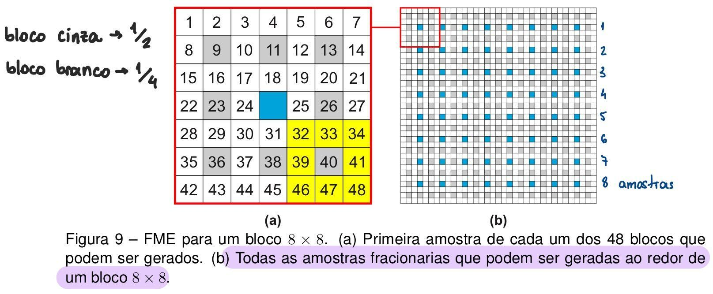
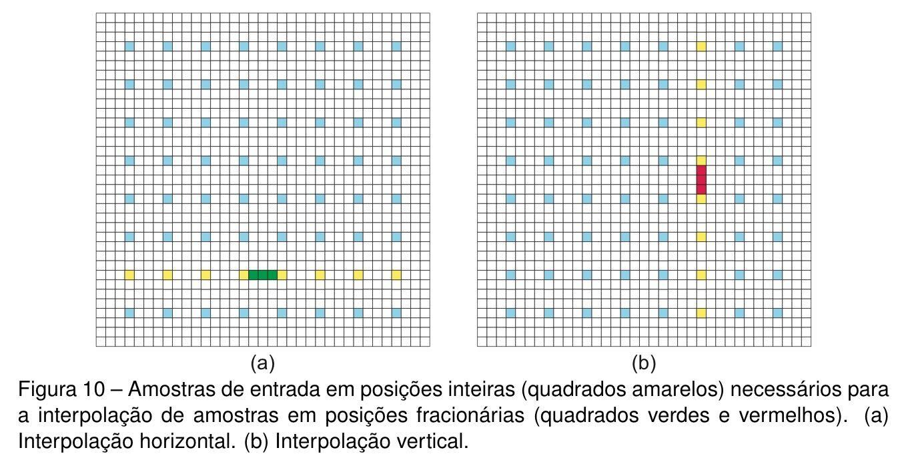

# Interpolation 
- VVC define filtros de interpolação de **8-taps**, que utilizam até 8 amostras de posições inteiras ao redor da amostra gerada: ?
- O VVC define que os Motion Vectors (MVs) tenham precisão de até 1/4, por exemplo entre os inteiros 1 e 2, temos: 1, 1.25, 1.50, 1.75 e 2. Logo, são necessários **3 filtros** diferentes de interpolação para gerar essas amostras fracionárias. 
- O bloco de pixels originais é na verdade o bloco resultante da **IME** e é a partir dele que devem ser gerados os pixels fracionários. 

