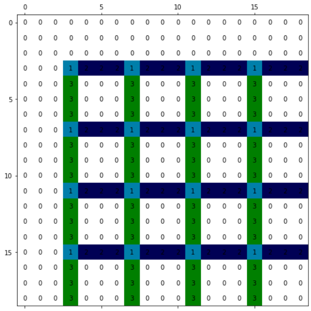

# Padding
- [ ] O valor do padding é 0? Ou outro valor? Como determinar seu valor?
- [ ] O padding serve para representar blocos inteiros originais, certo?
- [ ] O padding precisa estar rodeando, de todos os lados ou só no canto esquerdo e superior, como na imagem?
  